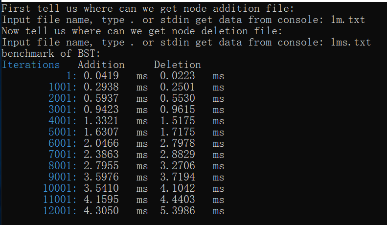
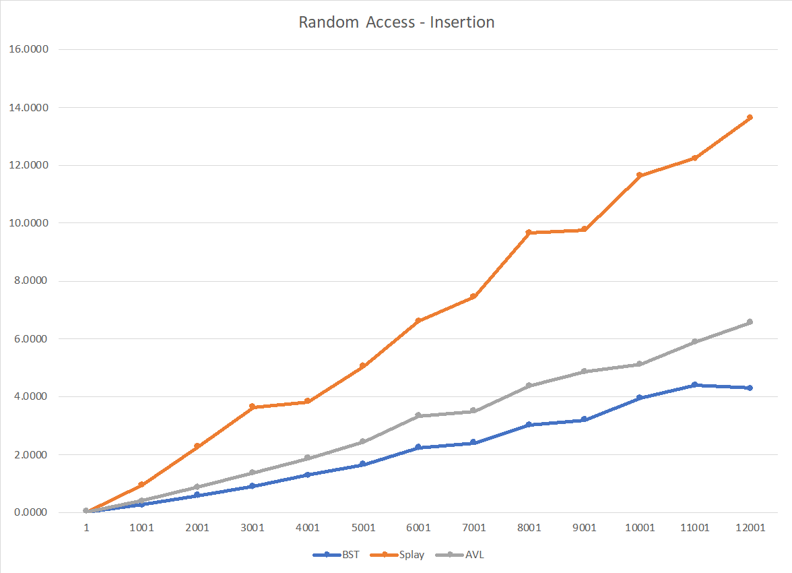
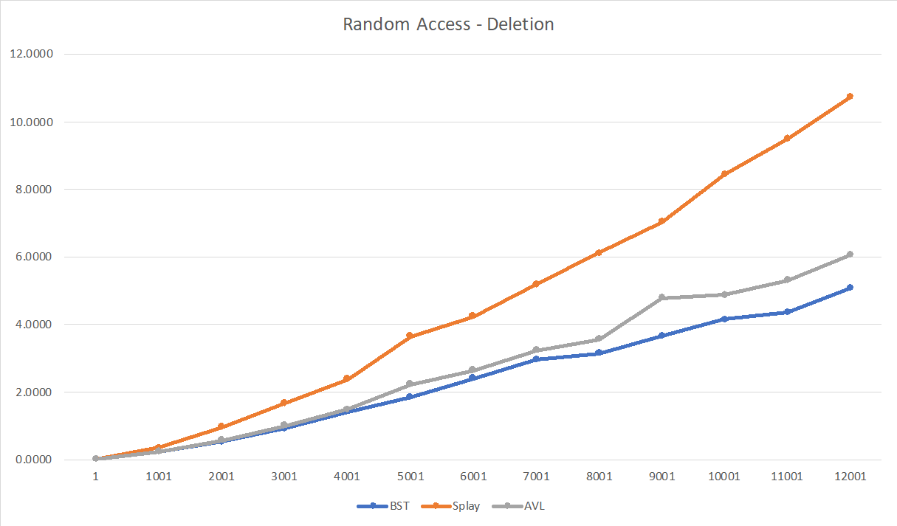
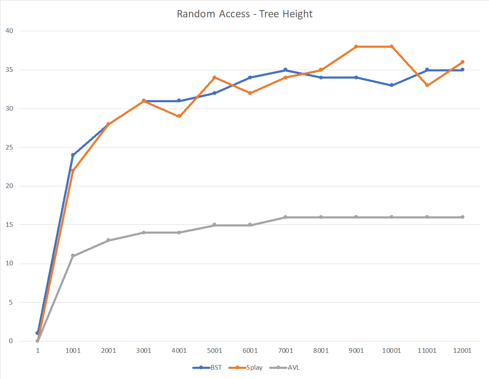
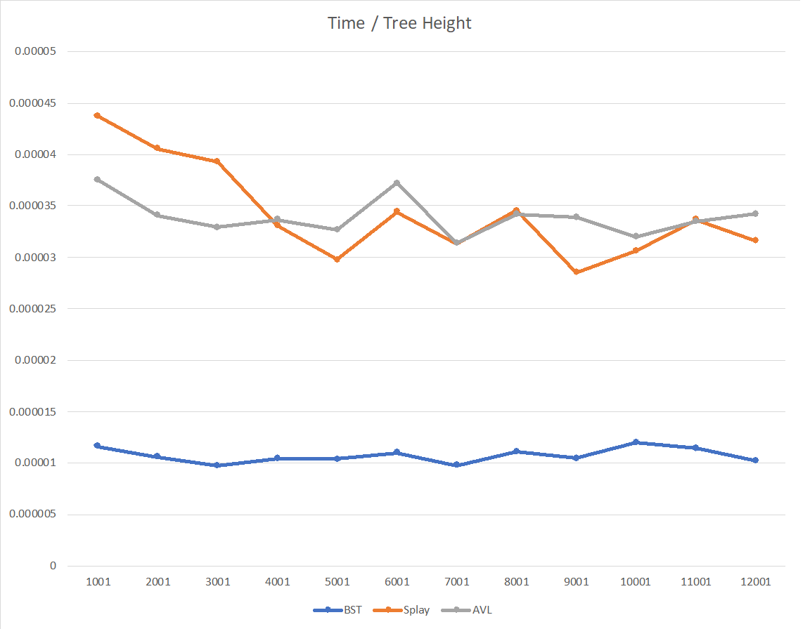
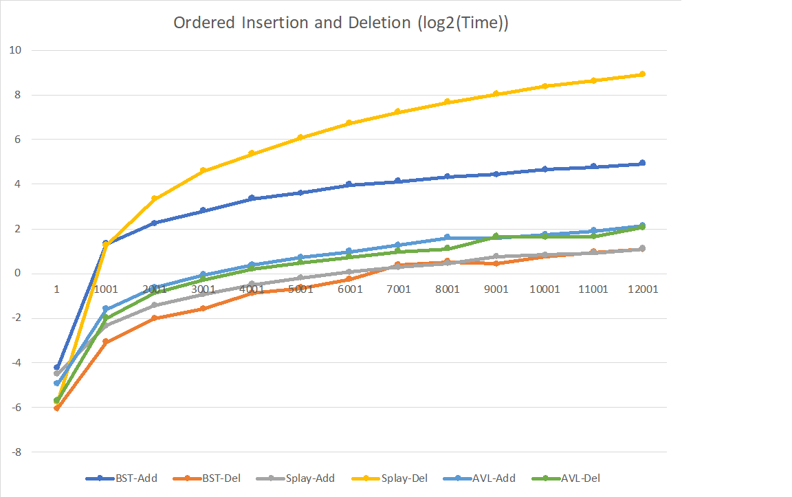
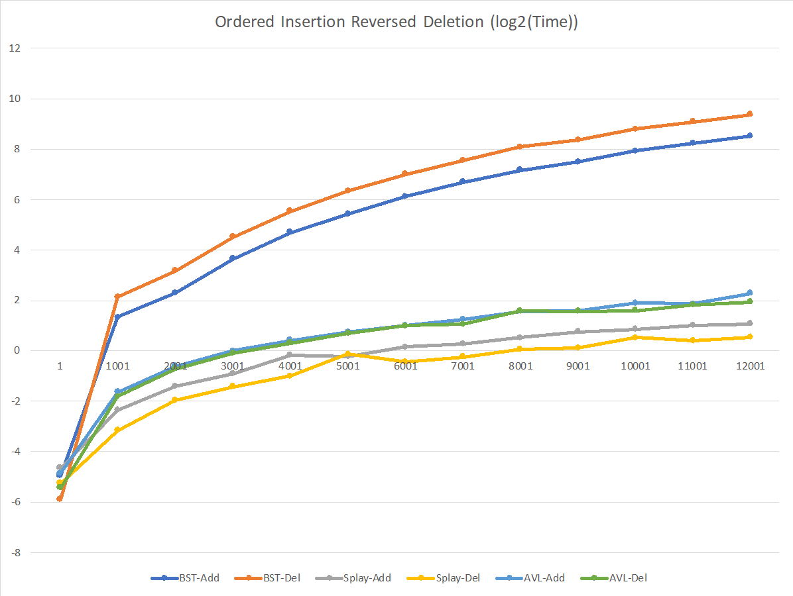

<div STYLE="page-break-after: always; vertical-align:middle;text-align:center;">
<h1>Binary Search Trees</h1>
    <h3>Authors: <span style='background-color:#eee; color:#aaa'>Group2:林昭炜，包文鼎，冯伟</span></h3>
<h3>Date: 2019-03-02</h3>
<h3>Zhejiang University</h3>
</div>


<h3>Table of Contents</h3>
#####  [ Chapter 1:  Introduction](#1)
Problem description and  back ground of the algorithms.

#####  [ Chapter 2:  Algorithm Specification](#2)
Description of all the algorithms involved for solving the problem, using pseudocode.
#####  [ Chapter 3:  Testing Results](#3)
Table of test cases. Comparison between the expected result and actual behavior. 
#####  [ Chapter 4:  Analysis and Comments](#4)
Performance of algorithms and possible improvements.
#####  [ Appendix: Source Code in C](#apdx0)
#####  [ Appendix: Tesscase Generator](#apdx1)
##### [References](#ref)
##### [Author List](#aut)
##### [Declaration](#dec)
##### [Signatures](#sig)


<br/>

<h4 style="font-weight:600">Declaration</h4>
<p style="background:#f4f4f8;padding:10px;font-weight:800">  We hereby declare that all the work done in this project titled "Binary Search Trees" is of our independent effort as a group.</p>
<div STYLE="page-break-after: always; vertical-align:center;">
</div>


## <span id="1"> Chapter 1: Introduction</span>

 

#### Problem Description

###### 1. Description

A binary search tree(BST) is a binary tree, each node of which has [0,2]
children. Typically, the three nodes, the left, the parent and the right node in any subtree of a BST meet the requirements that left.key < parent.key < right.key. 

 

As we can see, the best situation of the BST should be of height log(n) (n is the number of all nodes). However, chances are that we could gain a skew tree if the data is input increasingly or decreasingly.


To figure out this problem, we have AVL tree which is named after inventors Adelson-Velsky and Landis. In an AVL tree, the heights of the two child-subtrees of any node differ by at most one; if at any time they differ by more than one, rebalancing is done to restore this property.

Another data structure is splay tree. A splay tree is a self-adjusting binary search tree with the additional property that recently accessed elements are quick to access again. It performs basic operations such as insertion, look-up and removal in O(log n) amortized time.

###### 2. Goal & Main ideas

In this project, we are supposed to design three algorithms to apply operations including insertion and deletion on BST, AVL tree and splay tree. Moreover, we need to analyze the performances of the binary search trees, AVL trees, and splay trees by comparing the runtime of the three data structures.

#### Problem Back ground

###### 1. Binary Search Tree

An important application of binary tree is their use in searching. 

For every node X in the tree, the values of all keys in its left subtree are smaller than the key value in X, and the values of all keys in its right subtree are larger than the key value in X. This implies that all the elements in the tree can be ordered in some consistent manner.

https://en.wikipedia.org/wiki/Binary_search_tree

###### 2. AVL Tree

In computer science, an AVL tree is a self-balancing binary search tree. Note that when we need to insert integers in the AVL tree and the splay tree, we need to make appropriate adjustments to the tree.

In an AVL tree, we need to do RR rotation to the tree when the situation of the following picture’s upper half occurs. As we can see, the balance factor of X (we call it the trouble finder) is +2. So we make the trouble finder’s right subtree be the new root, make the X to the left child of Z
and connect the right child of Z to the X. We call this process Single
rotation. (Same way as the LL rotation.)


Another situation is the double rotation. The process are as follows.


###### 3. Splay Tree

In a splay tree, we have a different way to accomplish it, For any non-root node X , denote its parent by P and grandparent by G. If P is the root, we just simply rotate X and P. If P is not the root, we have two different situations. The specific operation is consistent with the AVL tree.

 

As for deletion, we just be careful to maintain the characteristics of the
different trees, The specific methods will be mentioned in chapter 2.

## <span id="2">Chapter 2: Algorithm Specification</span>

###### 1. Main Data Structure

We use linked list to store the trees. To store the information of each node, we define a struct tree including the value, the height , the left child and the right child of the node. And by the way, the height of the node is not necessary in the BST, so the height in the BST is omitted.

- The treenode of AVL tree and splay tree.

``` pseudocode
typedef struct tree
{
    int num, height; /* num is the value of one node, and height if the height of the node */
    struct tree* l, *r; /* represnt the left and right son of the node*/
}*treenode; 

```

- The treenode of BST.

``` pseudocode
typedef struct tree
{
    int num; /* num is the value of one node */
    struct tree* l, *r; /* represnt the left and right son of the node*/
}*treenode;

```

###### 2. Algorithms

- 2.1 BST

  The main operations are insertion and deletion. The insertion in the BST is simple.

  ``` pseudocode
  SearchTree  Insert( ElementType X, SearchTree T ) 
  { 
        if ( T == NULL ) { 
  	T = malloc( sizeof( struct TreeNode ) ); 
  	if ( T == NULL ) 
  	   FatalError( "Out of space!!!" ); 
  	else { 
  	   T->Element = X; 
  	   T->Left = T->Right = NULL; } 
        }  
       else 
   	if ( X < T->Element ) 
  	   T->Left = Insert( X, T->Left ); 
  	else 
  	   if ( X > T->Element ) 
  	      T->Right = Insert( X, T->Right ); 
      return  T;   
  }
  
  ```

  There are three situations in deletion which depends on the node has 0 or 1 or 2 children. If the node doesn’t has a child, we just delete it simply. If the node has only 1 child, we replace the node by its child. If the node has 2 children, we find the MAX node from its left subtrees or the MIN node from its right subtrees and replace the origin node.

  ``` pseudocode
  SearchTree  Delete( ElementType X, SearchTree T ) 
  {
      treenode temp = get the position of the X; 
      if (temp->leftchild!=NULL)
      {
          value = find the biggest from the leftchild; 
          temp->leftchild = delete_point(temp->leftchild, value); 
          temp->num = value;
      }
      else if (temp->rightchild!=NULL)
      {
          value = find the smallest from the rightchild);
          temp->rightchild = delete_point(temp->rightchild, value); 
          temp->num = value;
      }
      return T;
  }
  
  ```

  

- 2.2 AVL Tree

  As for AVL Tree, we need to determine if there is a trouble finder after each operation.

   ``` pseudocode
  if (head->num>ValueToBeInserted) /* recursively insert the node to the left branch */
          {
              head->leftchild=insert(head->leftchild, ValueToBeInserted);
              
              if (LeftChildHeight-RightChildHeight == 2) 
              {
                  if (ValueToBeInserted>head->leftchild->num) 
                  {
                      head = lr_rotate(head);
                  }
                  else head = ll_rotate(head);
              }
          }
          else if (head->num<ValueToBeInserted)  /* recursively insert the node to the right branch */
          {
              head->rightchild=insert(head->rightchild, ValueToBeInserted);
              if (RightChildHeight-LeftChildHeight == 2) /* balance the tree by rotating */
              {
                  if (ValueToBeInserted>head->rightchild->num)
                  {
                      head = rr_rotate(head);
                  }
                  else head = rl_rotate(head);
              }
          }
  
   ```

  As for LL rotation, we apply a single right rotation to the tree. First we make the trouble finder’s left child to the new root. Then we make the new root’s right child be the left child of the origin root. After that we make the origin root be the right child of the new root. Last we update the height of nodes we
  changed.

  ``` pseudocode
  treenode single_right_rotate(treenode head) 
  {
      treenode x = head->leftchild;
      head->leftchild=x->rightchild;
      x->r=head;
      head->height = max(LeftChildHeight,RightChildHeight))+1;
      head=x;
      head->height = max(LeftChildHeight,RightChildHeight))+1;
      return head;
  }
  
  ```

  For RR rotation, we apply a single left rotation to the tree. The application is the same as the single right rotation.

  ``` pseudocode
  treenode single_left_rotate(treenode head)
  {
      /* perfotm a left rotation */
      treenode x = head->r;
      head->r=x->l;
      x->l=head;
      update the height
      return head;
  }
  
  ```

  For RL rotation, we first apply a single right rotation then a single left rotation. The LR rotation is exactly the opposite to the RL rotation.

  For deletion, we just use the same way as the BST deletion. Be careful we need to determine the tree is balanced after each operation.

  ```pseudocode
  
  Delete(treenode head,data)
  {
  	if(data < head->data) Delete(head->left, data);
  	balance(head);
  	else if(data > head->data) Delete(head->right,data);
  	balance(head);
      else if(head->head && Tree->head)
     	replace head->data with successor or precursor;
     	Delete(head->right/left, successor/precursor);
      balance(head);
      else if(head->left==NULL)
      head = head->right;
      else if(head->right==NULL)
      head = head->left;
      update the height of the tree
  }
  ```

  

- 2.3 Splay Tree

  For splay tree, When a node *x* is accessed, a splay operation is performed on *x* to move it to the root. To perform a splay operation we carry out a sequence of *splay steps*, each of which moves *x* closer to the root. By performing a splay operation on the node of interest after every access, the recently accessed nodes are kept near the root and the tree remains roughly balanced, so that we achieve the desired amortized time bounds.

  ``` pseudocode
  treenode insert(treenode head, int x)
  {
  	if (head==NULL) /* initialize the tree*/
  	{
  		assign the value x and the height h to the head
  		return head;
  	}
  	else if (head->num<x) /* the node is in the right branch of node head */
  	{
  		if (head->r!=NULL)
  		{
  			head->r = insert(head->r, x);/* recursively insert x */
  			update the height of node
  			if (head->r->num == x) return head;
  			else /* perform rotation  */
  			{
  				temp = head->r; 
  				if (temp->l!=NULL&&temp->l->num==x)
  				{
  					head = rl_rotate(head);/* zig zag */
  					return head;
  				}
  				else if (temp->r!=NULL&&temp->r->num==x)
  				{
  					head = rr_rotate(head);/* zig zig */
  					return head;
  				}
  			}
  		}
  		else /* insert node x to the tree */
  		{
  			assign the value x and the height h to the head
  			return head;
  		}
  	}
  	else if (head->num>x)  /* similar to above, the node x is in the left branch of node head */
  	{
          omitted
  	}
  	return head; 
  }
  ```

  The deletion is simple in the splay tree. First find X that will be deleted, after which X will be the root of the tree. The remove X and find the max left subtrees or the min right subtrees to replace the old root.

  ``` pseudocode
  treenode deletion(treenode head, int x)
  {
  	head = rotate(head, x); /* rotate the node to the top */
  	if (head->num!=x) 
  		head=the successor or precursor of the node deleted;
  	if (head->leftchild!=NULL) 
  	{
  		x=precursor of the head;
  		head->leftchild = delete_point(head->leftchild, x); /* delete the leaf node we get*/
  		head->num = x;
  		return head;
  	}
  	else if (head->rightchild!=NULL)
  	{
  		x = successor of the head;
  		head->rightchild = delete_point(head->rightchild, x);
  		head->num = x;
  		return head; 
  	}
  	else return NULL;
  }
  ```

  

## <span id="3">Chapter 3:  Testing Results</span>

We designed a snippet of code to make sure that we need minimum adjustments to source code to benchmark it. To measure the accurate time, we accommodate code presented in [Microsoft's][MS] and [Linux's][LI] document. They are expected to work in both Windows and Unix-Like systems. Also, we craft a small piece of code to help us generate random numbers or test cases.

[MS]: https://docs.microsoft.com/en-us/windows/desktop/SysInfo/acquiring-high-resolution-time-stamps
[LI]: http://man7.org/linux/man-pages/man2/gettimeofday.2.html

Our benchmarker will present it in such style:





First we need to tell it data from `stdin` or any file. Currently we just hard code iteration times into code, so it will directly output results. The iteration column means how many times the program is iterated. And the other two columns are time used by addition or deletion operations. 

We benchmark it with loops, and that means we reuse the same tree in the iteration: first add N nodes then delete these N nodes. This is also a test for the robustness of our code, as we do not always start from a clean environment and any small problems, e.g. the tree stores pointers pointing to space already freed, in the benchmark will eventually escalate and forces the program to stop.

As we get a basic concept of how data is collected, we now present the complete set of our the benchmark results.


### AVL Tree

##### Random Access

| Iterations | Addition | Deletion | Tree height |
| ---------- | -------- | -------- | ----------- |
| 1          | 0.0403   | 0.0226   | 0           |
| 1001       | 0.4135   | 0.2428   | 11          |
| 2001       | 0.8879   | 0.5805   | 13          |
| 3001       | 1.3850   | 1.0158   | 14          |
| 4001       | 1.8883   | 1.503    | 14          |
| 5001       | 2.4551   | 2.2415   | 15          |
| 6001       | 3.3505   | 2.6479   | 15          |
| 7001       | 3.5211   | 3.2471   | 16          |
| 8001       | 4.3812   | 3.5867   | 16          |
| 9001       | 4.8865   | 4.8033   | 16          |
| 10001      | 5.1255   | 4.8832   | 16          |
| 11001      | 5.8984   | 5.3208   | 16          |
| 12001      | 6.5740   | 6.0769   | 16          |

##### Ordered insertion and deletion

| Iterations | Addition | Deletion | Tree height |
| ---------- | -------- | -------- | ----------- |
| 1          | 0.0325   | 0.0191   | 0           |
| 1001       | 0.3321   | 0.2509   | 9           |
| 2001       | 0.6482   | 0.5530   | 10          |
| 3001       | 0.9702   | 0.8289   | 11          |
| 4001       | 1.3232   | 1.1599   | 11          |
| 5001       | 1.6553   | 1.4087   | 12          |
| 6001       | 2.0060   | 1.6755   | 12          |
| 7001       | 2.4242   | 2.0041   | 12          |
| 8001       | 3.0835   | 2.1576   | 12          |
| 9001       | 3.0998   | 3.1560   | 13          |
| 10001      | 3.3944   | 3.1435   | 13          |
| 11001      | 3.7874   | 3.1844   | 13          |
| 12001      | 4.4403   | 4.2572   | 13          |

##### Ordered insertion and reversed deletion

| Iterations | Addition | Deletion | Tree height |
| ---------- | -------- | -------- | ----------- |
| 1          | 0.0347   | 0.0233   | 0           |
| 1001       | 0.3251   | 0.2889   | 9           |
| 2001       | 0.6603   | 0.6179   | 10          |
| 3001       | 1.0010   | 0.9455   | 11          |
| 4001       | 1.3465   | 1.2632   | 11          |
| 5001       | 1.6930   | 1.6336   | 12          |
| 6001       | 2.0354   | 2.0008   | 12          |
| 7001       | 2.3778   | 2.0848   | 12          |
| 8001       | 2.9742   | 3.0285   | 12          |
| 9001       | 3.0190   | 2.9840   | 13          |
| 10001      | 3.7358   | 3.0396   | 13          |
| 11001      | 3.6606   | 3.5782   | 13          |
| 12001      | 4.8840   | 3.8859   | 13          |


### BST

##### Random Access

| Iteration | Addition | Deletion | Tree height: |
| --------- | -------- | -------- | ------------ |
| 1         | 0.0470   | 0.0191   | 1            |
| 1001      | 0.2807   | 0.2429   | 24           |
| 2001      | 0.5946   | 0.5421   | 28           |
| 3001      | 0.9074   | 0.9366   | 31           |
| 4001      | 1.2979   | 1.4288   | 31           |
| 5001      | 1.6703   | 1.8619   | 32           |
| 6001      | 2.2506   | 2.4180   | 34           |
| 7001      | 2.4071   | 2.9797   | 35           |
| 8001      | 3.0328   | 3.1723   | 34           |
| 9001      | 3.2072   | 3.6707   | 34           |
| 10001     | 3.9654   | 4.1578   | 33           |
| 11001     | 4.4127   | 4.3767   | 35           |
| 12001     | 4.3055   | 5.0985   | 35           |

##### Ordered insertion and deletion

| Iteration | Addition | Deletion | Tree height |
| --------- | -------- | -------- | ----------- |
| 1         | 0.0534   | 0.0150   | 1           |
| 1001      | 2.5116   | 0.1177   | 1001        |
| 2001      | 4.8279   | 0.2495   | 1001        |
| 3001      | 7.1283   | 0.3393   | 1002        |
| 4001      | 10.3539  | 0.5463   | 1003        |
| 5001      | 12.2180  | 0.6440   | 1004        |
| 6001      | 16.0706  | 0.8361   | 1005        |
| 7001      | 17.6806  | 1.3289   | 1006        |
| 8001      | 20.2218  | 1.4504   | 1007        |
| 9001      | 22.0214  | 1.3652   | 1008        |
| 10001     | 25.5818  | 1.7212   | 1009        |
| 11001     | 27.7938  | 1.9564   | 1010        |
| 12001     | 30.9370  | 2.1305   | 1011        |

##### Ordered insertion and reversed deletion

| Iteration | Addition | Deletion | Tree height |
| --------- | -------- | -------- | ----------- |
| 1         | 0.0325   | 0.0168   | 1           |
| 1001      | 2.5441   | 4.4546   | 1001        |
| 2001      | 4.9436   | 9.2064   | 1001        |
| 3001      | 12.7133  | 23.0499  | 2001        |
| 4001      | 26.4734  | 47.0874  | 3001        |
| 5001      | 43.0697  | 81.6321  | 4001        |
| 6001      | 70.2302  | 129.5763 | 5001        |
| 7001      | 104.8476 | 189.8361 | 6001        |
| 8001      | 145.1742 | 272.5206 | 7001        |
| 9001      | 182.0994 | 331.2093 | 8001        |
| 10001     | 246.7944 | 449.0772 | 9001        |
| 11001     | 305.6383 | 554.4316 | 10001       |
| 12001     | 371.8552 | 673.6347 | 11001       |


### Splay Tree

##### Random Access

| Iterations | Addition | Deletion | Tree height |
| ---------- | -------- | -------- | ----------- |
| 1          | 0.0459   | 0.0259   | 0           |
| 1001       | 0.9641   | 0.3667   | 22          |
| 2001       | 2.2742   | 0.9726   | 28          |
| 3001       | 3.6608   | 1.6858   | 31          |
| 4001       | 3.8421   | 2.3863   | 29          |
| 5001       | 5.0687   | 3.6540   | 34          |
| 6001       | 6.6155   | 4.2577   | 32          |
| 7001       | 7.4668   | 5.1940   | 34          |
| 8001       | 9.6867   | 6.1299   | 35          |
| 9001       | 9.7735   | 7.0423   | 38          |
| 10001      | 11.6574  | 8.4631   | 38          |
| 11001      | 12.2458  | 9.4992   | 33          |
| 12001      | 13.6567  | 10.7514  | 36          |

##### Ordered insertion and deletion

| Iterations | Addition | Deletion | Tree height: |
| ---------- | -------- | -------- | ------------ |
| 1          | 0.0439   | 0.0181   | 0            |
| 1001       | 0.1994   | 2.4013   | 1000         |
| 2001       | 0.3718   | 10.1269  | 2000         |
| 3001       | 0.5232   | 24.6556  | 3000         |
| 4001       | 0.7133   | 41.7467  | 4000         |
| 5001       | 0.8858   | 68.1864  | 5000         |
| 6001       | 1.0546   | 107.8778 | 6000         |
| 7001       | 1.2313   | 152.5484 | 7000         |
| 8001       | 1.3713   | 206.7272 | 8000         |
| 9001       | 1.7147   | 263.7039 | 9000         |
| 10001      | 1.7852   | 334.9770 | 10000        |
| 11001      | 1.9062   | 403.9057 | 11000        |
| 12001      | 2.1663   | 489.4664 | 12000        |

##### Ordered insertion and reversed deletion

| Iterations | Addition | Deletion | Tree height |
| ---------- | -------- | -------- | ----------- |
| 1          | 0.0400   | 0.0266   | 0           |
| 1001       | 0.1962   | 0.1122   | 1000        |
| 2001       | 0.3788   | 0.2575   | 2000        |
| 3001       | 0.5373   | 0.3772   | 3000        |
| 4001       | 0.8885   | 0.5019   | 4000        |
| 5001       | 0.8675   | 0.9179   | 5000        |
| 6001       | 1.1188   | 0.7465   | 6000        |
| 7001       | 1.2217   | 0.8565   | 7000        |
| 8001       | 1.4551   | 1.0477   | 8000        |
| 9001       | 1.7050   | 1.0977   | 9000        |
| 10001      | 1.8094   | 1.4549   | 10000       |
| 11001      | 2.0163   | 1.3342   | 11000       |
| 12001      | 2.1114   | 1.4615   | 12000       |


<div STYLE="page-break-after: always;"></div> 


## <span id = "4">  Chapter 4:  Analysis and Comments</span>

In this chapter we will dig deep in to the data. First we have to analysis random access to the tree, as we believe this may be the most common scenario. Following pictures including total time spent on insertion and deletion as is suggested by the titles of the charts.






We can see from charts that BST actually triumphs splay tree and AVL tree in terms of speed. From first glance BST maybe the best choice, but deeper analysis reveals that BST has approximately the same height as splay tree while AVL tree manages to maintain one third of BST's height.




Still, AVL tree is slower than BST because its complicated algorithm. We also compared the average time spent per height. This will tell us how much the complicated algorithm adds to the overhead. And from the chart we can see BST can visit one level of tree (i.e. recursion) with much less overhead.




We also need to test on some special cases. Following is a chart illustrating time spent to complete ordered insertions and ordered deletions jobs. As is shown in chapter 3, there is a huge performance gap between deferent algorithms. Thus, we figure it's better to compute the logarithm of the time. Splay tree is the worst among three trees as it works in vain to get elements to top of the tree only to find that the next element is actually at the bottom. BST is almost as bad as splay tree.




Another special case worth mentioning is that we insert ordered elements and delete them in reversed fashion. This time its seems all the optimization efforts put into splay tree and AVL tree paid off. 



We will now talk about the complexity of these 3 algorithms theoretically.

#### Space complexity

First we will observe that for all 3 trees, every time we insert a number or whatever variable we wishes the tree to hold, we need a constant sized new node. Let $S(N)$ denote space complexities of N operations. Thus we can see that the space complexity for both average and worst case is :
$$
S(N) = O(N), \quad where\ N\ is\ number\ of\ nodes\ in\ tree.
$$


#### Time Complexity

##### BST

In the worst case,  we may obtain a skewed tree, when we insert ordered data. Under such circumstances, we are essentially traversing an array to search for elements. Thus, any operations on this tree will require:

1. locate the element in tree. That means we may have to dig down to the bottom of the tree to find it, which gives us $O(N)$ time complexity.

2. do some specific tasks like moving around nodes to update the tree. This will take constant time, which gives us $O(1)$

Hence we get worst case time complexity for all operations in BST:
$$
T_{worst}(N) = O(N)  + O(1) = O(N), \quad where\ N\ is\ number\ of\ nodes\ in\ tree.
$$
In the average case, the number of comparisons used in BST hit ending at a given node is depth of this node + 1. So we assume the sum of depths of all nodes is $C_N$. Then we know that average time used to find an element is $1+C_N/N$ . We have $C_0=C_1=0$ and we can write the following equation:
$$
C_N=N-1 + (C_0+C_{N-1}) /N + (C_1+C_{N-2}) /N + ...(C_{N-1}+C_{0}) /N.
$$
With algebraic manipulation:
$$
NC_N=N(N+1)+2(C_0+C_1+...C_{N-1}).
$$
Subtracting same equation for $N-1$ gives:
$$
NC_N-(N-1)C_{N-1}=2N+2C_{N-1}.
$$
So we get:
$$
C_N \sim 2(N+1)(1/3+1/3+...1/(N+1)), \\
C_N \sim 2NlnN \sim 1.39Nlog(N).
$$
Therefore, as stated before, other specific details of operations will take constant times, we get average time for all operations of BST:
$$
T_{avg}(N) = O(log(N)) + O(1) = O(logN), \quad where\ N\ is\ number\ of\ nodes\ in\ tree.
$$
As for amortized cost, since we know that worst case is $O(N)$ , and suppose the first time operations is $t_0$.  the the total time for $n$ operations will be: 
$$
T_{total}(n) = t_0+(t_0+1)+...(t_0+n), \quad where\ N\ is\ number\ of\ nodes\ in\ tree.
$$
Hence we get the amortized cost:
$$
T_{amo} = T_{total}(n) / n = O(n), \quad where\ n\ is\ number\ of\ nodes\ in\ tree.
$$

##### AVL Tree

The number of comparison in AVL tree will determine time complexity of the tree.

Suppose minimum number of nodes in AVL tree of AVL tree is $S(h)$. Then we have:
$$
S(h) = S(h-1) +S(h-2)+1
$$
It is self evident that it is the worst case. So we have 
$$
S(h) = k\times m^{h} + b.
$$
where $k, m, b$ are constants. So $h \sim log(Number of Nodes)$ for both worst case and average case.

Therefore we get:
$$
T_{avg}(N)=T_{worst}(N) = O(logN), \quad where\ N\ is\ number\ of\ nodes\ in\ tree.
$$
For amortized cost, we still add the worst case and divide them by $N$ and we get:
$$
T_{amo} = NO(logN)/N = O(logN), \quad where\ N\ is\ number\ of\ nodes\ in\ tree.
$$

##### Splay Tree

We will first analyze the amortized cost of splay tree. Suppose $r(R) = log_2(N)$, where $N$ is number of nodes in sub-tree  rooted at node $R$. And assume that $S = \sum r(U_i)$ , where $U_i$ is sub-node of root $R$ including $R$. in the zig step:
$$
S = r'(P) - r(P)+ r'(X)-r'(X) \\
= r'(P)-r(X) \le r'(X) - r(X)
$$
in the zig-zig step:
$$
S = r'(G)-r'(G)+r'(P)-r'(P)+r'(X)-r(X) \\
= r'(G)+r'(P)-r(P)-r(X) \\
= r'(G)+r'(X)-2r(X)\\
\le 3(r'(X) - r(X)) - 2
$$
and in the zig-zag step:
$$
S=r'(g)-r(G)+r'(P)-r(P)+r'(X)-r(X)\\
\le r'(G)+r'(G)-2r(X) \\
\le 3(r'(X)-r(X)) -2
$$
Hence, 
$$
T_{amo} = k + S \le 3(r'(X)-r(X)) - 2 + k = O(logN)+O(1) = O(logN).
$$
And worst case is:
$$
T_{worst}(N) = N, \quad where\ n\ is\ number\ of\ nodes\ in\ tree.
$$
Since we know that minimum time is $T_{min}(N) = O(logN)$ as the tree is at least $logN$ height.

We have:
$$
O(logN) = T_{min} \le T_{avg} \le T_{amo} = O(logN).
$$
Thus, we get:
$$
T_{avg} =O(logN)
$$


## <span id = "apdx0">Appendix：Source Code in C</span>

##### BST

``` c
#include<stdio.h>
#include<stdlib.h>
#include "benchmark.h"
#include "input.h"

typedef struct tree{
	int num; /* num is the value of one node */
	struct tree* l, *r; /* represnt the left and right son of the node*/
	}*treenode; 
treenode insert(treenode head, int x);
treenode del(treenode head, int x);/* delete the node */
int find_smallest(treenode head); /* find the succssor of one node in Inorder Traversal */
int find_biggest(treenode head); /* find the precursor of one node in Inorder Traversal */
treenode del_point(treenode head, int x); /* recursively delete the node while maintaining the search tree*/
treenode get(treenode head, int x);/* find the position of the node to be delete*/
int in_tree(treenode head, int x)
{
	if (head==NULL) return 0;
	if (head->num == x) return 1;
	if (head->num<x)	return in_tree(head->r, x);
	else return in_tree(head->l, x);
}

int get_height(treenode head) {
	if(head == NULL) return 0;
	int l = get_height(head->l);
	int r = get_height(head->r);
	l = l > r ? l : r;
	return ++l;
}

int main()
{
    int n, i, x;
    
    printf("First tell us where can we get node addition file: \n");
	FILE* add_input = get_input();
	if(add_input == NULL) return 0; /* user choose to exit */
	printf("Now tell us where can we get node deletion file: \n");
	FILE* del_input = get_input();
	if(del_input == NULL) return 0; /* user choose to exit */
	
    treenode head = NULL;/* initalize the tree */
    
BENCHMARK_READY("BST", 1000, 13001)

	BENCHMARK_BEGIN_PART("Addition")
        fscanf(add_input, "%d",&x);
        head = insert(head, x);/* insert node to the tree */
    BENCHMARK_END_PART()
	int add_height = get_height(head);
    BENCHMARK_BEGIN_PART("Deletion")
        fscanf(del_input, "%d",&x);
        if(in_tree(head, x)) {
			head = del(head, x); /* delete the node valued x from the tree */
		}
    BENCHMARK_END_PART()
	printf("Tree height: %d.", add_height);
BENCHMARK_FINISH()
	getchar(); getchar(); getchar();
	return 0;
}

treenode insert(treenode head, int x)
{
    if (head==NULL) /* find position to insert the node */
    {
        head=malloc(sizeof(struct tree));
        head->l = NULL;
        head->r = NULL;
        head->num = x;
        return head;
    }
    /* else insert the node recursively */
    else if (head->num<x)
    {
        head->r = insert(head->r, x); 
        return head;
    }
    else if (head->num>x)
    {
        head->l = insert(head->l, x);
        return head;
    }
    else return head;
}
treenode del(treenode head, int x)
{
    int v;
    treenode temp = get(head, x);  /* find the position of the node to be delete */
    if (temp->l!=NULL)
    {
        v = find_biggest(temp->l);   /* find the precursor of one node in Inorder Traversal */
        temp->l = del_point(temp->l, v); /* delete the node */ 
        temp->num = v;
    }
    else if (temp->r!=NULL)
    {
        v = find_smallest(temp->r);  /* find the succssor of one node in Inorder Traversal */
        temp->r = del_point(temp->r, v); /* delete the node */ 
        temp->num = v;
    }
    return head;
}
int find_smallest(treenode head) /* find the succssor of one node in Inorder Traversal */
{
	if (head->l==NULL)	return head->num;
	return find_smallest(head->l);
}
int find_biggest(treenode head) /* find the precursor of one node in Inorder Traversal */
{
	if (head->r==NULL) return head->num;
	return find_biggest(head->r);
}
treenode del_point(treenode head, int x) /* recursively delete the node while maintaining the search tree*/
{
	if (head->num==x) /* the node to be delete has only left son or right son, so return it */
	{
		if (head->l!=NULL) return head->l;
		return head->r;
	}
	else if (head->num>x)
	{
		head->l = del_point(head->l, x);
		return head;
	}
	else 
	{
		head->r = del_point(head->r, x);
		return head;
	}
}
treenode get(treenode head, int x) /* find the position of the node to be delete */
{
    if (head->num == x)
        return head;
    else if (head->num>x)
        return get(head->l, x);
    else return get(head->r, x);
}

```


##### AVL Tree

``` c
#ifdef _MSC_VER
#define _CRT_SECURE_NO_WARNINGS
#endif // _MSC_VER

#include<stdio.h>
#include<stdlib.h>
#include "benchmark.h"
#include "input.h"

typedef struct tree{
	int num, height; /* num is the value of one node, and height if the height of the node */
	struct tree* l, *r; /* represnt the left and right son of the node*/
	}*treenode; 
	
treenode insert(treenode head, int x);
treenode del(treenode head, int x);
/* two functions to insert or delete nodes */

treenode ll_rotate(treenode head);
treenode lr_rotate(treenode head);
treenode rr_rotate(treenode head);
treenode rl_rotate(treenode head);
/* four types of rotating situations */

treenode single_left_rotate(treenode head); 
treenode single_right_rotate(treenode head);
/* two forms of single rotation */

int find_biggest(treenode head);
int find_smallest(treenode head);
/* find the precursor or succssor of one node in Inorder Traversal */

int check(treenode head); /* unnecessary! */
int findh(treenode head); /* get the height of a node, it will return -1 represent its value is NULL */
int max(int x, int y)
{
	if (x>y) return x;
	return y;
}
int in_tree(treenode head, int x)
{
	if (head==NULL) return 0;
	if (head->num == x) return 1;
	if (head->num<x)	return in_tree(head->r, x);
	else return in_tree(head->l, x);
}
int main()
{
	int n, m, x, i;
	printf("First tell us where can we get node addition file: \n");
	FILE* add_input = get_input();
	if(add_input == NULL) return 0; /* user choose to exit */
	printf("Now tell us where can we get node deletion file: \n");
	FILE* del_input = get_input();
	if(del_input == NULL) return 0; /* user choose to exit */
	
	treenode head=NULL;
	
BENCHMARK_READY("AVL Tree", 1000, 13001)
	
	BENCHMARK_BEGIN_PART("Addition")
		fscanf(add_input, "%d",&x);
		head = insert(head, x);	/* insert the node and keep the avl tree */
	BENCHMARK_END_PART()
	
		int add_height = head ? head->height : 0;

	BENCHMARK_BEGIN_PART("Deletion")
		fscanf(del_input, "%d",&x);
		if(in_tree(head, x)) {
			head = del(head, x); /* delete the node valued x from the tree */
		}
	BENCHMARK_END_PART()
		printf("Tree height: %d.", add_height);
BENCHMARK_FINISH()
		getchar(); getchar(); getchar();
	return 0;
}

treenode insert(treenode head, int  x)
{
	if (head==NULL) /* initalize the tree */
	{
		head=malloc(sizeof(struct tree));
		head->l=NULL;
		head->r=NULL;
		head->num=x;
		head->height=0;
		return head;
	}
	else 
	{
		if (head->num>x) /* recursively insert the node to the left branch */
		{
			head->l=insert(head->l, x);
			
			if (findh(head->l)-findh(head->r) == 2) /* balance the tree by rotating */
			{
				if (x>head->l->num) 
				{
					head = lr_rotate(head);
				}
				else head = ll_rotate(head);
			}
		}
		else if (head->num<x)  /* recursively insert the node to the right branch */
		{
			head->r=insert(head->r, x);
			if (findh(head->r)-findh(head->l) == 2) /* balance the tree by rotating */
			{
				if (x>head->r->num)
				{
					head = rr_rotate(head);
				}
				else head = rl_rotate(head);
			}
		}
	}
	head->height=1+max(findh(head->l),findh(head->r)); /* update the height of node  */
	return head;
}
treenode single_right_rotate(treenode head) 
{
	/* perform a right rotation */
	treenode x = head->l;
	head->l=x->r;
	x->r=head;
	head->height = max(findh(head->l),findh(head->r))+1;
	head=x;
	head->height = max(findh(head->l),findh(head->r))+1;
	return head;
}
treenode single_left_rotate(treenode head)
{
	/* perfotm a left rotation */
	treenode x = head->r;
	head->r=x->l;
	x->l=head;
	head->height = max(findh(head->l),findh(head->r))+1;
	head=x;
	head->height = max(findh(head->l),findh(head->r))+1;
	return head;
}

/* rotations for four different situations */
treenode ll_rotate(treenode head)
{
	head = single_right_rotate(head);
	return head;
}
treenode rr_rotate(treenode head)
{
	head = single_left_rotate(head);
	return head;
}
treenode lr_rotate(treenode head)
{
	head->l= single_left_rotate(head->l);
	head = single_right_rotate(head);
	return head;
}
treenode rl_rotate(treenode head)
{
	head->r = single_right_rotate(head->r);
	head = single_left_rotate(head);
	return head;
}

int findh(treenode head) /* get the height of node, -1 represent NULL */
{
	if (head==NULL) return -1;
	else return head->height;
}
treenode del(treenode head, int x) /* delete the node valued x */
{
	if (head==NULL) return head;
	if (head->num<x) /* recursively delete the node from left branch */
	{
		head->r = del(head->r, x);
		head->height = 1+max(findh(head->l), findh(head->r));
		if (findh(head->l)-findh(head->r)==2) /* balance the tree */
		{
			treenode temp = head->l;
			if (findh(temp->l)>findh(temp->r)) 
			{
				head = ll_rotate(head);
			}
			else 
			{
				head = lr_rotate(head);
			}
		}
			
	}
	else if (head->num>x) /* recursively delete the node from right branch */
	{
		head->l = del(head->l, x);
		head->height = 1+max(findh(head->l), findh(head->r));
		if (findh(head->r)-findh(head->l)==2) /* balance the tree */
			{
				treenode temp = head->r;
				if (findh(temp->r)>findh(temp->l)) 
				{
					head = rr_rotate(head);
				}
				else 
				{
					head = rl_rotate(head); 
				}
			}
			
	}
	else if (head->num == x) /* the current node should be delete */ 
	{
		if (head->l!=NULL)  /* find the precursor of one node in Inorder Traversal */
		{
			x=find_biggest(head->l);
			head->l = del(head->l,x);
			head->num = x;
			head->height = 1+max(findh(head->l), findh(head->r)); /* update the height of node */
			if (findh(head->r)-findh(head->l)==2)
			{
				treenode temp = head->r;
				if (findh(temp->r)>findh(temp->l))
				{
					head = rr_rotate(head);
				}
				else 
				{
					head = rl_rotate(head); 
				}
			}
		}	
		else if (head->r!=NULL) /* find the succssor of one node in Inorder Traversal */
		{
			x=find_smallest(head->r);
			head->r = del(head->r, x);
			head->num = x;
			head->height = 1+max(findh(head->l), findh(head->r));
			if (findh(head->l)-findh(head->r)==2)
			{
				treenode temp = head->l;
				if (findh(temp->l)>findh(temp->r))
				{
					head = ll_rotate(head);
				}
				else 
				{
					head = lr_rotate(head);
				}
			}
				
		}
		else 
		{
			return NULL; /* the node is a leaf node, so just delete it */
		}
	}
	return head;
}
int find_biggest(treenode head)  /* recursively find the precursor of one node in Inorder Traversal */
{
	if (head->r==NULL)
		return head->num;
	return find_biggest(head->r);
}
int find_smallest(treenode head) /* recursively find the succssor of one node in Inorder Traversal */
{
	if (head->l==NULL)
		return head->num;
	return find_smallest(head->l);
}
int check(treenode head)
{
	if (head==NULL) return 1;
	if (check(head->l)&&check(head->r)&&abs(findh(head->l)-findh(head->r))<2)
		return 1;
	return 0; 
} 

```


##### Splay Tree

``` c
#include<stdio.h>
#include<stdlib.h>
#include "benchmark.h"
#include "input.h"

/* use linked list to store the splay tree */
typedef struct tree{
	int num, height; /* num is the value of one node, and height if the height of the node */
	struct tree* l, *r; /* represnt the left and right son of the node*/
	}*treenode; 
	
treenode ll_rotate(treenode head);
treenode lr_rotate(treenode head);
treenode rr_rotate(treenode head);
treenode rl_rotate(treenode head);
/* four types of rotating situations */

treenode single_left_rotate(treenode head); 
treenode single_right_rotate(treenode head);
/* two single operations of rotation*/


int findh(treenode head);
/* get the height of a node, it will return -1 represent its value is NULL */

treenode insert(treenode head, int x);
treenode del(treenode head, int x);
treenode rotate(treenode head, int x);
/* operate insert and delete operations using function rotate */

treenode work(treenode head, int x);
/* if the height of the node is odd, the function'll perform a single rotation */ 

int check(treenode head, int x);
/* it's unnecessary, only use to simplely check the program (may be deleted) */

treenode del_point(treenode head, int x);
/* delete the node */
int find_smallest(treenode head);
int find_biggest(treenode head);
/* find the precursor or succssor of one node in Inorder Traversal */
int max(int a, int b)
{
	if (a>b) return a;
	return b;
}
int in_tree(treenode head, int x)
{
	if (head==NULL) return 0;
	if (head->num == x) return 1;
	if (head->num<x)	return in_tree(head->r, x);
	else return in_tree(head->l, x);
}
int main()
{
	int n, i, x;
	treenode head = NULL;
	
	printf("First tell us where can we get node addition file: \n");
	FILE* add_input = get_input();
	if(add_input == NULL) return 0; /* user choose to exit */
	printf("Now tell us where can we get node deletion file: \n");
	FILE* del_input = get_input();
	if(del_input == NULL) return 0; /* user choose to exit */
	
BENCHMARK_READY("Splay Tree", 1000, 13001)
	BENCHMARK_BEGIN_PART("Addition")
		fscanf(add_input, "%d", &x);
		head = insert(head, x); /* insert n nodes in order*/
		if (head && head->num!= x)
			head = work(head, x);/* perform a single rotation */
		// printf("%d\n",check(head, x));/* check if the tree is proper: we don't need that in our benchmark */
	BENCHMARK_END_PART()
	
	int add_height = head ? head->height : 0;
	
	BENCHMARK_BEGIN_PART("Deletion")
		fscanf(del_input, "%d", &x);
		if(in_tree(head, x)) {
			head = del(head, x); /* delete the node valued x from the tree */
		}
	BENCHMARK_END_PART()
	
	printf("Tree height: %d.", add_height);
	
BENCHMARK_FINISH()

	getchar(); getchar(); getchar();
	return 0;	
}
treenode insert(treenode head, int x)
{
	treenode temp;
	if (head==NULL) /* initialize the tree*/
	{
		head=malloc(sizeof(struct tree));
		head->num = x;
		head->height = 0;
		head->l = NULL;
		head->r = NULL;
		return head;
	}
	else if (head->num<x) /* the node is in the right branch of node head */
	{
		if (head->r!=NULL)
		{
			head->r = insert(head->r, x);/* recursively insert x */
			head->height = 1+max(findh(head->l), findh(head->r));/* update the height of node */
			if (head->r->num == x) return head;
			else /* perform rotation  */
			{
				temp = head->r; 
				if (temp->l!=NULL&&temp->l->num==x)
				{
					head = rl_rotate(head);
					return head;
				}
				else if (temp->r!=NULL&&temp->r->num==x)
				{
					head = rr_rotate(head);
					return head;
				}
			}
		}
		else /* insert node x to the tree */
		{
			temp = malloc(sizeof(struct tree));
			temp->num = x;
			temp->height = 0;
			temp->l = NULL;
			temp->r = NULL;
			head->r = temp;
			head->height = 1+max(findh(head->l), findh(head->r));
			return head;
		}
	}
	else if (head->num>x)  /* similar to above, the node x is in the left branch of node head */
	{
		if (head->l!=NULL) 
		{
			head->l = insert(head->l, x); /* recursively insert node x */
			head->height = 1+max(findh(head->l), findh(head->r)); /* update the height */
			if (head->l->num == x)
				return head;
			temp = head->l; 
			/* perform rotation to move node x to the top */	
				if (temp->l!=NULL&&temp->l->num==x)
				{
					head = ll_rotate(head);
					return head;
				}
				else if (temp->r!=NULL&&temp->r->num==x)
				{
					head = lr_rotate(head);
					return head;
				}
		}
		else /* insert node x to the tree */
		{
			temp = malloc(sizeof(struct tree));
			temp->num = x;
			temp->height = 0;
			temp->l = NULL;
			temp->r = NULL;
			head->l = temp;
			head->height = 1+max(findh(head->l), findh(head->r));
			return head;
		}
	}
	return head; 
}
treenode work(treenode head, int x)
{
	if (head->num>x) /* if x is the left child of head, perform right rotation */
	{
		head = single_right_rotate(head);
		return head;
	}
	head = single_left_rotate(head); /* else x is the right child of head, perform left rotation */
	return head;
}
treenode del(treenode head, int x)
{
	head = rotate(head, x); /* rotate the node to the top */
	if (head->num!=x) 
		head = work(head, x);
	/* find the successor or precursor of the node deleted */
	if (head->l!=NULL) 
	{
		x=find_biggest(head->l);
		head->l = del_point(head->l, x); /* delete the leaf node we get*/
		head->num = x;
		return head;
	}
	else if (head->r!=NULL)
	{
		x = find_smallest(head->r);
		head->r = del_point(head->r, x);
		head->num = x;
		return head; 
	}
	else return NULL;
}
treenode del_point(treenode head, int x) /* recursively delete the leaf node while maintaining the search tree*/
{
	if (head->num==x)
	{
		if (head->l!=NULL) return head->l;
		return head->r;
	}
	else if (head->num>x)
	{
		head->l = del_point(head->l, x);
		return head;
	}
	else 
	{
		head->r = del_point(head->r, x);
		return head;
	}
}
int find_smallest(treenode head) /* find the succssor of one node in Inorder Traversal */
{
	if (head->l==NULL)	return head->num;
	return find_smallest(head->l);
}
int find_biggest(treenode head) /* find the precursor of one node in Inorder Traversal */
{
	if (head->r==NULL) return head->num;
	return find_biggest(head->r);
}
treenode rotate(treenode head, int x) /* perform rotation before deletion, similar to the insert function */ 
{
	treenode temp;
	if (head->num == x)
	{
		return head;
	}
	else if (head->num<x) /* x is at right sub tree */
	{
		temp = head->r;
		if (temp->num == x) return head;
		if ((temp->l==NULL||temp->l->num!=x)&&(temp->r==NULL||temp->r->num!=x))
			head->r = rotate(head->r, x);
		temp = head->r;	
		if (temp->num == x) return head;
		if (temp->l!=NULL&&temp->l->num==x)
		{
			head = rl_rotate(head);
		} 
		else 
		{
			head = single_left_rotate(head);
			head = single_left_rotate(head);
		}
		
	}
	else if (head->num>x)
	{
		temp = head->l;
		if (temp->num==x) return head;
		if ((temp->l==NULL||temp->l->num!=x)&&(temp->r==NULL||temp->r->num!=x))
			head->l = rotate(head->l, x);
		temp = head->l;
		if (temp->num==x) return head;
		if (temp->l!=NULL&&temp->l->num==x)
		{
			head = single_right_rotate(head);
			head = single_right_rotate(head);
		}
		else 
		{
			head =lr_rotate(head);
		}
	}
	return head;
}
treenode single_right_rotate(treenode head) /* perform right rotation */
{
	treenode x = head->l;
	head->l=x->r;
	x->r=head;
	head->height = max(findh(head->l),findh(head->r))+1;
	head=x;
	head->height = max(findh(head->l),findh(head->r))+1;
	return head;
}
treenode single_left_rotate(treenode head) /* perform left rotation */
{
	treenode x = head->r;
	head->r=x->l;
	x->l=head;
	head->height = max(findh(head->l),findh(head->r))+1;
	head=x;
	head->height = max(findh(head->l),findh(head->r))+1;
	return head;
}
treenode ll_rotate(treenode head) /* perform two right rotation */
{
	head = single_right_rotate(head);
	head = single_right_rotate(head);
	return head;
}
treenode rr_rotate(treenode head) /* perform two left rotation */
{
	head = single_left_rotate(head);
	head = single_left_rotate(head);
	return head;
}
treenode lr_rotate(treenode head) /* perform left rotation and then right rotation */
{
	head->l= single_left_rotate(head->l);
	head = single_right_rotate(head);
	return head;
}
treenode rl_rotate(treenode head)  /* perform right rotation and then left rotation */
{
	head->r = single_right_rotate(head->r);
	head = single_left_rotate(head);
	return head;
}
int findh(treenode head) /* get height of one node */
{
	if (head==NULL) return -1;
	else return head->height;
}
int check(treenode head, int x)
{
	if (head->num!=x)
		return 0;
	return 1;	
}

```


## <span id = "apdx1">Appendix:Testcase Generator</span>

##### input.h

``` c
#ifndef _INPUT_H_
#define _INPUT_H_
#include <stdio.h>

/* returns NULL when user wishes to exit*/
inline FILE * get_input()
{
	FILE *input = NULL;
	char buf[512] = {0};
	while(input == NULL) {
		printf("Input file name, type . or stdin get data from console: ");
		fscanf(stdin, "%s", buf);
		if(strcmp(buf, "exit") == 0) return NULL;
		int x = '\n';
		int b = '\r';
		if(buf[0] == '.' || strcmp(buf, "stdin") == 0) 
			return stdin;
		input = fopen(buf, "r");
		if(input == NULL) printf("Unable to open file.");
	}
	return input;
}

#endif

```


##### benchmark.h

``` c
#ifndef _BENCHMARK_H_
#define _BENCHMARK_H_

#include <stdio.h>
#include <time.h>

#if defined (WIN32) || defined (_WIN32)

#include <windows.h>
// https://docs.microsoft.com/en-us/windows/desktop/SysInfo/acquiring-high-resolution-time-stamps
double get_time()
{
    LARGE_INTEGER time, frequency;
    QueryPerformanceCounter(&time);
    QueryPerformanceFrequency(&frequency);
    return (double)time.QuadPart/(double)frequency.QuadPart;
}

#else
// http://man7.org/linux/man-pages/man2/gettimeofday.2.html
#include <sys/time.h>
#include <sys/resource.h>
/*
int gettimeofday(struct timeval *tv, struct timezone *tz);
//                                   ^^^^ Don't Care ^^^ 

struct timeval {
   time_t      tv_sec;     // seconds
   suseconds_t tv_usec;    // microseconds 
};
*/
double get_time()
{
    struct timeval tv;
    gettimeofday(&tv, NULL);
    return tv.tv_sec + tv.tv_usec*1e-6;
}

#endif

#define COLOR_LIST(V)          \
	V(Cyan,  0x3, 36)          \
	V(Blue,  0x1, 34)          \
	V(Green, 0x2, 32)          \
	V(Red,   0x4, 31)          \
	V(Magent,0x5, 35)          \
	V(Yellow,0x6, 33)          \
	V(White, 0x7, 37)          \
	V(Black, 0x0, 37)          

enum Colors {
#define ENUM_COLOR(c, win, nix) k##c,
	COLOR_LIST(ENUM_COLOR)
#undef ENUM_COLOR
	kNumberOfColors,
	kDark  = ~(1 << 10),
};

#ifdef WIN32
#include <windows.h>
#undef max
#undef min

inline void set_console_color(int color) {
	HANDLE hStdout = GetStdHandle(STD_OUTPUT_HANDLE);             
	if (hStdout == INVALID_HANDLE_VALUE)                          
	{                                    
		return;                                                   
	}                                                             
	switch (color & kDark)
	{
#define WIN_COLOR(c, win, nix)                                                 \
	case k##c:                                                                 \
		if(color & ~kDark)                                                     \
			SetConsoleTextAttribute(hStdout, win | FOREGROUND_INTENSITY );     \
		else                                                                   \
			SetConsoleTextAttribute(hStdout, win);                             \
		break;
		COLOR_LIST(WIN_COLOR);
#undef WIN_COLOR
	default:
		break;
	}
}


// Unix
#else

inline void set_console_color(int color) {
	switch (color & kDark) {
#define NIX_COLOR(c, win, nix)                  \
        case k##c:                              \
        	printf("\033[0;40;" #nix "m");      \
            break;
		COLOR_LIST(NIX_COLOR);
#undef NIX_COLOR
		default:
			break;
	}
}
#endif

inline void benchmark_output(double span) {
	if(span < 1.0) {
		printf("%-8.4lf ms  ", span * 1000);
	}
	else {
		printf("%-8.4lf s   ", span);
	}
}

inline void benchmark_print_gutter(int row_num) {
	set_console_color(kCyan);
	printf("%12d: ", row_num);
	set_console_color(kWhite & kDark); /* set it to default, i.e. grey */
}

#define BENCHMARK_READY(Name_, IterateTimeStep_, IterateTimeMax_) \
	do {                                                          \
		/***** print table title *****/                           \
		printf("benchmark of %s: \n", Name_);                     \
		set_console_color(kCyan);                                 \
		printf("%-13s", "Iterations");                            \
		set_console_color(kWhite & kDark);                        \
		                                                          \
		/* First iteration of outer loop is ignore, hence */      \
		/* we have to compensate it */                            \
		int bm_loop_cnt_ = 1 - IterateTimeStep_;                  \
		                                                          \
		/***** outer loop: benchmark each time step *****/        \
		for(; bm_loop_cnt_ < IterateTimeMax_;                     \
	          bm_loop_cnt_ += IterateTimeStep_) {                 \
		    if(bm_loop_cnt_ > 0) {                                \
		    	benchmark_print_gutter(bm_loop_cnt_);             \
			}

#define BENCHMARK_BEGIN_PART(ColumnName_)                       \
		do {                                                    \
		/***** print table column *****/                        \
		static bm_first_time_ = 1;                              \
		if(bm_first_time_) {                                    \
			printf("%-13s", ColumnName_);                       \
			bm_first_time_ = 0;                                 \
			break;                                              \
		}                                                       \
		                                                        \
	    int bm_i_ = 0;                                          \
		double bm_tick_ = get_time();                           \
		/***** inner loop: benchmark a single step *****/       \
	    	for(; bm_i_ < bm_loop_cnt_; ++bm_i_) {              \

#define BENCHMARK_END_PART()                                    \
			} /* end of inner loop*/                            \
			double bm_tock_ = get_time();                       \
			benchmark_output(bm_tock_ - bm_tick_);              \
		}while(0);
	
#define BENCHMARK_FINISH()                                      \
			printf("\n");                                       \
		} /* end of outer loop*/                                \
	} while(0);

#undef COLOR_LIST

#endif

```


##### rand.c

``` c
/* This program is intended to generate file of random numbers*/
#include <stdio.h>
#include <stdlib.h>
#include <string.h>
#include "benchmark.h"

void shuffle(int buf[], int size, FILE *out) {
	int i, tmp, sh;
	for(i = 0; i < size; ++i) {
		sh = rand() % size;
		tmp = buf[sh];
		buf[sh] = buf[i];
		buf[i] = tmp;
		fprintf(out, "%d ", buf[i]);
	}
}
/* we don't sand() for debug purpose */
int main(int argc, char *argv[]){
	int cnt;
	int i;
	char dst[] = "res.txt";
	char dst_shuffle[] = "ress.txt";
	int *buf;
	if(argc > 1) {
		cnt = atoi(argv[1]);
	}
	else {
		printf("Input amount of data (-1 for ordered): ");
		scanf("%d", &cnt);
	}
	/* Generate a huge chunk of ordered data */
	if(cnt == -1) {
		printf("Input amount of ordered data: ");
		scanf("%d", &cnt);
		FILE* fp = fopen(dst, "w");
		fprintf(fp, "%d\n", cnt);
		for(i = 0; i < cnt; ++i)
			fprintf(fp, "%d ", i); /* Here fp is ordered data */
		fclose(fp);
		fp = fopen(dst_shuffle, "w");
		fprintf(fp, "%d\n", cnt);
		for(i = cnt; i > 0;)
			fprintf(fp, "%d ", --i); /* Here fp is reversed ordered data */
		fclose(fp);
		printf("Done !\n");
		return 0;
	}
	/* Generate ordered data that matches benchmarker */
	if(cnt == -2) {
		/*We simply utilize benchmarker to generate ordered data*/
		FILE* a = fopen(dst, "w"); /* Here a is ordered data */
		FILE* b = fopen(dst_shuffle, "w"); /* Here b is reversed ordered data */
		/* we doubled the data to make sure that there is enough testcases*/
BENCHMARK_READY("Generate Benchmark to create data.", 1000, 23001)
		int m = 0;
		BENCHMARK_BEGIN_PART("Addition")
			fprintf(a, "%d ", m++);
		BENCHMARK_END_PART()
		fprintf(a, "\n");
		
		BENCHMARK_BEGIN_PART("Addition")
			fprintf(b, "%d ", --m);
		BENCHMARK_END_PART()
		fprintf(b, "\n");
		
BENCHMARK_FINISH()
		fclose(a);
		fclose(b);
		return 0;
	}
	/* Generate randomly ordered data and shuffled */
	FILE* fp = fopen(dst, "w");
	fprintf(fp, "%d\n", cnt);
	buf = (int *)malloc(sizeof(int) * cnt);
	for(i = 0; i < cnt; ++i) {
		buf[i] = rand();
		fprintf(fp, "%d ", buf[i]);
	}
	fclose(fp);
	
	fp = fopen(dst_shuffle, "w");
	fprintf(fp, "%d\n", cnt);
	shuffle(buf, cnt, fp);
	fclose(fp);
	free(buf);
	
	char *pos = strrchr(argv[0], '\\');
	if(pos) *pos = '\0';
	printf("Data written to %s\\%s.\n A shuffled version is stored at the same directory named %s", argv[0], dst, dst_shuffle);
	return 0;
}


```

## <span id = "ref"> References </span>

[1]. https://en.wikipedia.org/wiki/Binary_search_tree

[2]. https://en.wikipedia.org/wiki/AVL_tree

[3]. https://en.wikipedia.org/wiki/Splay_tree

## <span id = "aut"> Author List </span>

Programming:包文鼎

Testing:林昭炜

Documentation:冯伟

## <span id = "dec"> Declaration </span>

**We hereby declare that all the work done in this project titled "Binary Search Tree" is of our independent efforts as a group.**

## <span id = "sig"> Signatures</span>

